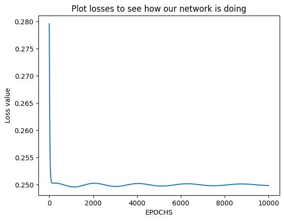
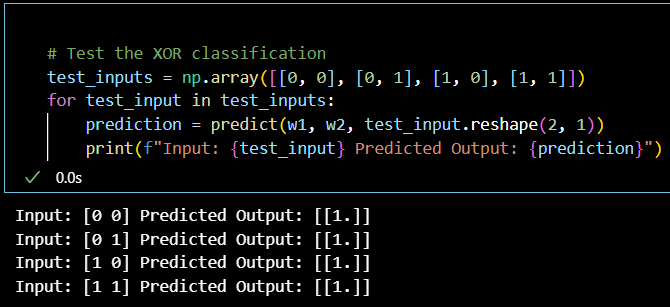

<H3> NAME : KAVINRAJA D</H3>
<H3>REGNO : 212222240047</H3>
<H3>EX. NO.3</H3>
<H3>DATE:</H3>
<H2 aligh = center> Implementation of MLP for a non-linearly separable data</H2>
<h3>Aim:</h3>
To implement a perceptron for classification using Python
<H3>Theory:</H3>
Exclusive or is a logical operation that outputs true when the inputs differ.For the XOR gate, the TRUTH table will be as follows:

XOR truth table


XOR is a classification problem, as it renders binary distinct outputs. If we plot the INPUTS vs OUTPUTS for the XOR gate, as shown in figure below


The graph plots the two inputs corresponding to their output. Visualizing this plot, we can see that it is impossible to separate the different outputs (1 and 0) using a linear equation.To separate the two outputs using linear equation(s), it is required to draw two separate lines as shown in figure below:

For a problem resembling the outputs of XOR, it was impossible for the machine to set up an equation for good outputs. This is what led to the birth of the concept of hidden layers which are extensively used in Artificial Neural Networks. The solution to the XOR problem lies in multidimensional analysis. We plug in numerous inputs in various layers of interpretation and processing, to generate the optimum outputs.
The inner layers for deeper processing of the inputs are known as hidden layers. The hidden layers are not dependent on any other layers. This architecture is known as Multilayer Perceptron (MLP).

The number of layers in MLP is not fixed and thus can have any number of hidden layers for processing. In the case of MLP, the weights are defined for each hidden layer, which transfers the signal to the next proceeding layer.Using the MLP approach lets us dive into more than two dimensions, which in turn lets us separate the outputs of XOR using multidimensional equations.Each hidden unit invokes an activation function, to range down their output values to 0 or The MLP approach also lies in the class of feed-forward Artificial Neural Network, and thus can only communicate in one direction. MLP solves the XOR problem efficiently by visualizing the data points in multi-dimensions and thus constructing an n-variable equation to fit in the output values using back propagation algorithm

<h3>Algorithm :</H3>

Step 1 : Initialize the input patterns for XOR Gate<BR>
Step 2: Initialize the desired output of the XOR Gate<BR>
Step 3: Initialize the weights for the 2 layer MLP with 2 Hidden neuron  and 1 output neuron<BR>
Step 3: Repeat the  iteration  until the losses become constant and  minimum<BR>
    (i)  Compute the output using forward pass output<BR>
    (ii) Compute the error<BR>
	(iii) Compute the change in weight ‘dw’ by using backward progatation algorithm. <BR>
    (iv) Modify the weight as per delta rule.<BR>
    (v)  Append the losses in a list <BR>
Step 4 : Test for the XOR patterns.

### Program:</H3>
```py
import numpy as np
import pandas as pd
import matplotlib.pyplot as plt

# Initialize the input vector and output vector for XOR
x = np.array([[0, 0, 1, 1], [0, 1, 0, 1]])
y = np.array([[0, 1, 1, 0]])
# Initialize the structure of MLP with input, hidden, and output layer
n_x = 2
n_y = 1
n_h = 2
m = x.shape[1]
lr = 0.1

# Weight matrix for hidden layer randomly
w1 = np.random.rand(n_h, n_x)
w2 = np.random.rand(n_y, n_h)
losses = []

def sigmoid(z):
    return 1 / (1 + np.exp(-z))

def sigmoid_derivative(z):
    return sigmoid(z) * (1 - sigmoid(z))

def forward_prop(w1, w2, x):
    z1 = np.dot(w1, x)
    a1 = sigmoid(z1)
    z2 = np.dot(w2, a1)
    a2 = sigmoid(z2)
    return z1, a1, z2, a2

def back_prop(m, w1, w2, z1, a1, z2, a2, y, lr):
    dz2 = a2 - y
    dw2 = (1 / m) * np.dot(dz2, a1.T)
    dz1 = np.dot(w2.T, dz2) * sigmoid_derivative(z1)
    dw1 = (1 / m) * np.dot(dz1, x.T)
    w1 -= lr * dw1
    w2 -= lr * dw2
    return w1, w2

def train_mlp(w1, w2, x, y, lr, iterations):
    for i in range(iterations):
        z1, a1, z2, a2 = forward_prop(w1, w2, x)
        loss = np.mean(np.square(a2 - y))
        losses.append(loss)
        w1, w2 = back_prop(m, w1, w2, z1, a1, z2, a2, y, lr)
    return w1, w2

def predict(w1, w2, input):
    _, _, _, a2 = forward_prop(w1, w2, input)
    return np.round(a2)

# Train the MLP
iterations = 10000
w1, w2 = train_mlp(w1, w2, x, y, lr, iterations)

# Plot losses to see how our network is doing
plt.plot(losses)
plt.xlabel("EPOCHS")
plt.ylabel("Loss value")
plt.show()

# Test the XOR classification
test_inputs = np.array([[0, 0], [0, 1], [1, 0], [1, 1]])
for test_input in test_inputs:
    prediction = predict(w1, w2, test_input.reshape(2, 1))
    print(f"Input: {test_input} Predicted Output: {prediction}")

```

## Output:
### Plot losses to see how our network is doing


### Test the XOR classification

<H3> Result:</H3>
Thus, XOR classification problem can be solved using MLP in Python 
